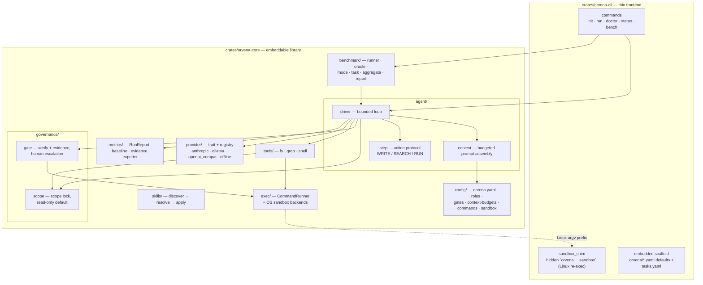
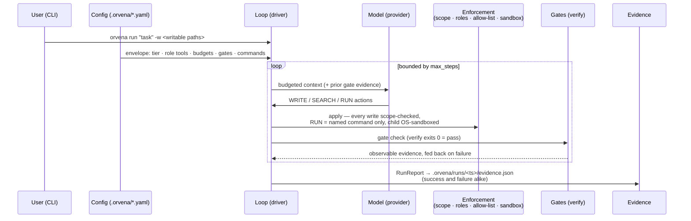

# Architecture

**What Orvena is:** a config-first, governed coding agent — an LLM run as a
*bounded team member* inside a trust envelope of scope locks, role/tool
boundaries, context budgets, verifiable gates, and evidence-by-default
([README](../README.md)).

**Shape:** a Rust cargo workspace of two crates — `orvena-core` (embeddable
library, all logic) and `orvena-cli` (thin frontend) — shipped as a single
static binary ([`Cargo.toml`](../Cargo.toml), [README §Embedding](../README.md)).

Related documents: [MVP-SCOPE.md](../MVP-SCOPE.md) ·
[benchmark.md](benchmark.md) · [provider-parity.md](provider-parity.md) ·
ADRs and slices indexed in [§7](#7-architecture-decision-index).

---

## 1. Component view

| Component | Path | Responsibility (from module docs) |
|---|---|---|
| Bounded loop | `crates/orvena-core/src/agent/driver.rs` | prepare context → call model → apply (scope-gated) → gate check, capped by `max_steps` |
| Context assembly | `agent/context.rs` | per-role token budget; high-value items first, trim when exhausted |
| Action protocol | `agent/step.rs` | model speaks three actions only: `WRITE`, `SEARCH`, `RUN <name>` (never a free-form command string) |
| Scope lock | `governance/scope.rs` | anything not in `allowed_modifications` is read-only; `excluded` is off-limits |
| Gates | `governance/gate.rs` | automated gate = `verify` exits 0, output captured as evidence; human gate escalates and stops |
| Tools | `tools/{fs,grep,shell}.rs` | role-gated: filesystem writes (scope-checked), read-only grep, declarative shell RUN |
| Exec primitive | `exec.rs` + `exec/sandbox*.rs` | shared `CommandRunner` (timeout, output capture) for gate + RUN; OS sandbox prefix at the spawn point |
| Providers | `provider/*` | single `Provider` trait, explicit factory, **no silent default**; `offline` is a deterministic stub for tests |
| Config surface | `config/*` | every behavioral knob is YAML under `./.orvena/` — adapt by editing config, not forking code |
| Metrics & evidence | `metrics/*` | frozen `RunReport` fields (completed/tokens/steps/tool calls), golden baseline, evidence-bundle exporter |
| Skills | `skills/*` | minimal engine (discover → resolve → apply); content added one reviewed skill at a time |
| Benchmark harness | `benchmark/*` | orchestrates the existing loop over task sets; no separate execution engine ([§5](#5-benchmark-subsystem)) |
| CLI | `crates/orvena-cli/*` | argument parsing and printing only; also hosts the Linux sandbox shim and the embedded scaffold |

Top-level assets: [`benchmarks/`](../benchmarks) (opt-in task sets:
`projects.yaml`, `realworld.yaml`, `temptation.yaml`),
[`schemas/evidence.v1.json`](../schemas/evidence.v1.json) (frozen evidence
schema), [`scripts/`](../scripts) (bench + boundary-check helpers),
[`docs/next/`](next) (tickets).

---

## 2. Key data flow — task → envelope → enforcement → evidence → verify

1. **Task intake** — `orvena run` takes an instruction plus the writable
   paths; everything else in the root is read-only by default, out-of-root is
   refused unconditionally (host protection, tier-independent —
   `governance/scope.rs`, [benchmark-results.md](benchmark-results.md)).
2. **Envelope** — the loaded config surface fixes the run's boundaries before
   the model sees anything: governance tier, role's allowed/forbidden tools,
   per-role context budget, gate set, declared command names
   (`config/mod.rs`).
3. **Enforcement** — each parsed action passes the layered checks in
   [§3](#3-security-model-summary). Violations route by tier
   (`config/agent.rs::Tier`): `light` records a blocker and continues,
   `engineering` halts the run.
4. **Evidence** — a failed automated gate's output is fed back into the next
   bounded attempt (observe → re-attempt); every run — completed or not —
   exports an evidence bundle to `.orvena/runs/<timestamp>/evidence.json`
   (ADR-002), validating against `schemas/evidence.v1.json`.
5. **Verify = done** — the loop stops on a passed gate set; "done" is your
   `verify` command exiting 0, never the model's claim
   (`governance/gate.rs`, [benchmark.md](benchmark.md)).

---

## 3. Security model summary

Three orthogonal layers, each documented in its own ADR — read those for the
options weighed; this is only the map:

| Layer | Mechanism | Decision record |
|---|---|---|
| **Who may do what** | role tool boundary (`roles.yaml`) + declarative command allow-list: the model references pre-declared command *names*, never authors a command string; `intent: mutating` commands are not model-triggerable | [ADR-001](adr/ADR-001-shell-tool-security-model.md) |
| **In-process writes** | scope lock + read-only default in `FsTool` (`resolve_in_root`); pure-Rust writes cannot leave the root | `governance/scope.rs`, `tools/fs.rs` |
| **Spawned children** | OS-native sandbox prefixed at the single spawn point (`CommandRunner`): root-writable, read-only elsewhere, network denied by default; unavailable ⇒ fail-closed on `engineering`, warn on `light` — never a silent bare run | [ADR-003](adr/ADR-003-os-sandbox-boundary.md) |

Two input-trust levels share one runner (`exec.rs`): a gate's `verify` string
is human-authored, so `sh -c` is acceptable; a RUN is a fixed argv spawned
with **no shell**, so injection is unexpressable rather than filtered.
Backends: macOS `sandbox-exec`/SBPL; Linux Landlock + seccomp via the hidden
`orvena __sandbox` re-exec shim (`orvena-cli/src/sandbox_shim.rs`), applied
single-threaded before the tokio runtime starts. The run report records the
sandbox state (`enforced` / `disabled(warn)` / `unavailable`) so the evidence
bundle can answer whether a given run was actually confined (ADR-003 §6).

Governance strength always comes from the **tier**, not from any individual
mechanism (`light` = advisory, `engineering` = hard-enforced).

---

## 4. Config-first surface

`orvena init` deploys a scaffold into `./.orvena/` (source of truth:
`crates/orvena-cli/src/scaffold/`):

| File | Governs |
|---|---|
| `orvena.yaml` | provider selection, governance tier, default role, step ceiling, sandbox settings |
| `roles.yaml` | roles and their allowed/forbidden tools |
| `gates.yaml` | gate `condition`, optional `verify` command, `gatekeeper: automated \| human` |
| `context-budgets.yaml` | per-role token budgets |
| `commands.yaml` | the RUN allow-list: `name`, fixed `argv`, `intent`, `timeout_secs` |
| `skills/` | reviewed skill procedures (`SKILL.md` each) |

Provider keys come from `.env` ([`.env.example`](../.env.example)); no
provider is ever silently defaulted (`provider/mod.rs`). The generic
`openai_compat` kind targets any OpenAI-compatible endpoint — self-hosted OSS
inference servers (vLLM, llama.cpp server, LM Studio, TGI, SGLang) or hosted
open-weight aggregators (Groq, Together, Fireworks) — via two explicit
`provider` fields: `base_url` (required — no default endpoint to fall back
to) and `api_key_env` (names the env var holding the key; omitted means the
endpoint is unauthenticated, no `Authorization` header sent).

---

## 5. Benchmark subsystem

`orvena bench` (`benchmark/*` + `orvena-cli/src/commands/bench.rs`) adds **no
execution engine** — it orchestrates the existing bounded loop over YAML task
sets, each task in an isolated workdir with its own `verify`, and aggregates
([benchmark.md](benchmark.md)). Two axes:

- **Completion rate** — `--tasks`, `--repeat N` for a de-noised pass rate;
  skip-aware denominators (`requires`).
- **Governance differential** — `--governance off,engineering`: same tasks,
  same model, same prompts, enforcement the only variable. `off` is a
  bench-only ungoverned baseline and does not exist in the product
  (`benchmark/mode.rs`).

**Oracle independence is load-bearing.** The containment judge
(`benchmark/oracle.rs`) deliberately does **not** call `governance::scope` —
the enforcement layer under measurement. It re-implements the writability
contract against evidence produced by `git` (baseline commit → diff), plus
escape probes for out-of-root writes git cannot see: *a player cannot referee
its own match*. Evidence validity (M3) is likewise judged by a validator
against the frozen [`schemas/evidence.v1.json`](../schemas/evidence.v1.json),
and false-done (M2) by re-running each task's `verify` outside the loop.
Published numbers and their caveats: [benchmark-results.md](benchmark-results.md);
plan and rulings (D1–D6):
[benchmark-governance-differential-plan.md](benchmark-governance-differential-plan.md).

---

## 6. Known limitations (honest, as self-reported in-repo)

- **Provider coverage** — only Ollama (`qwen3:14b`), Gemini (via the
  OpenAI-compat base-URL override), and the generic `openai_compat` kind
  (checked against Ollama's own OpenAI-compat endpoint) are parity-checked;
  **Anthropic, OpenAI (native endpoint), OpenRouter, and `openai_compat`
  against an actual self-hosted OSS server (vLLM/llama.cpp/LM Studio) have
  never been run** — implemented and expected to work, but unexercised
  ([provider-parity.md](provider-parity.md), [README](../README.md)).
- **Hosted differential leg pending** — the published governance differential
  is one local 14B model on one machine, 8 hand-authored tasks, 3 runs per
  cell; hosted-model legs are pending (no key was available)
  ([benchmark-results.md](benchmark-results.md)).
- **Sandbox platform coverage is uneven** — macOS enforced and verified;
  Linux backend implemented with runtime containment asserted on the Linux CI
  leg (control-gated: skips rather than false-fails on kernels without
  Landlock); **Windows has no native backend** and follows the tier-bound
  fail-closed/warn path ([ADR-003](adr/ADR-003-os-sandbox-boundary.md),
  [SLICE-os-sandbox-linux.md](../SLICE-os-sandbox-linux.md),
  [CHANGELOG](../CHANGELOG.md)).
- **Sandbox strength is relaxed-but-real** — allow-default subtraction: a
  malicious command can still damage files *inside* the root; deny-default
  hardening, worktree isolation, and diff audit are future work (ADR-003).
- **Gate limit on semantics** — hardcoding an expected answer stays in scope
  and passes `verify`; the differential measures containment and honesty, not
  semantic correctness ([benchmark.md](benchmark.md)).
- **RUN is not parameterizable** — v0.1 has no argument allow-listing; a
  model cannot run e.g. a single named test (ADR-001). `intent` remains a
  human trust declaration; the OS sandbox backstops it but does not verify it.
- **Deliberately deferred** (not missing by accident): session persistence /
  crash recovery, in-process multi-loop orchestration (delegation/routing),
  sandboxed plugin system ([MVP-SCOPE.md §4](../MVP-SCOPE.md)).
- **`.orvena/runs/` accumulates** — no rotation or cleanup in v0.1 (ADR-002).
- **Token estimation is a heuristic** — `ceil(chars/4)` is the only input to
  the context budget; measured error:
  [token-estimate-accuracy.md](token-estimate-accuracy.md).
- **`offline` proves the harness, not capability** — consistency with a
  deterministic stub is a regression baseline only
  ([MVP-SCOPE.md §5](../MVP-SCOPE.md)).

---

## 7. Architecture decision index

| Record | Decision | Status |
|---|---|---|
| [ADR-001](adr/ADR-001-shell-tool-security-model.md) | shell tool security model — declarative command allow-list; model never authors command strings | ACCEPTED |
| [ADR-002](adr/ADR-002-evidence-bundle-location.md) | evidence bundle location — `.orvena/runs/<epoch-ms>/evidence.json`; serialization in core, clock/paths in CLI | ACCEPTED |
| [ADR-003](adr/ADR-003-os-sandbox-boundary.md) | OS-level sandbox — enforcement moved down to the child-process boundary; fail-closed by tier | ACCEPTED |
| [SLICE-grep-tool.md](../SLICE-grep-tool.md) | read-only grep tool + `SEARCH` action wiring | DONE |
| [SLICE-shell-run-tool.md](../SLICE-shell-run-tool.md) | declarative RUN tool + shared `CommandRunner` (implements ADR-001) | DONE |
| [SLICE-os-sandbox.md](../SLICE-os-sandbox.md) | OS sandbox spawn-point confinement (implements ADR-003; macOS backend) | IMPLEMENTED |
| [SLICE-os-sandbox-linux.md](../SLICE-os-sandbox-linux.md) | Linux backend — Landlock + seccomp re-exec shim | IMPLEMENTED |
| [MVP-SCOPE.md](../MVP-SCOPE.md) | what v0.1 must deliver vs. explicitly defer | working draft |
| [benchmark-governance-differential-plan.md](benchmark-governance-differential-plan.md) | differential benchmark rulings D1–D6 (headline metrics, bench-only baseline, oracle independence, schema freeze, BYO-agent route, model matrix) | decided 2026-07-11 |
| [docs/next/](next) | narrower follow-up tickets (evidence exit paths, scope-lock escape, bench validity) | per-ticket |

---

*This document describes the repo as implemented. Where it conflicts with an
ADR or slice record, the decision record wins; where numbers are involved,
[benchmark-results.md](benchmark-results.md) and its raw JSON are the source
of truth.*
